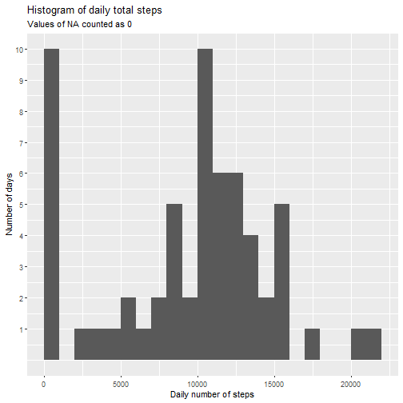
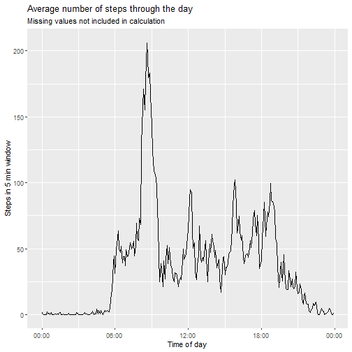
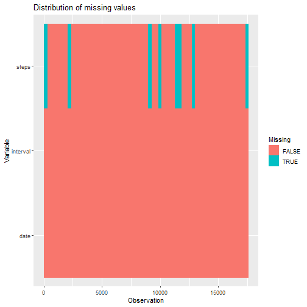
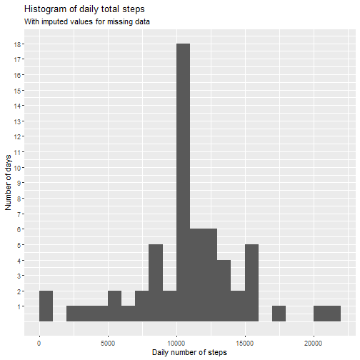
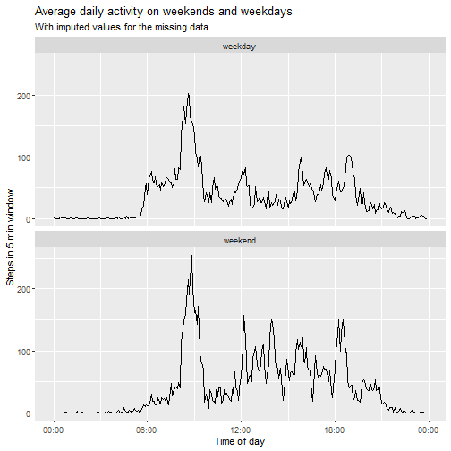

## Prerequisites

We 'll use the `tidyverse` and `lubridate` packages:


```r
library(tidyverse)
library(lubridate)
```

## Loading and preprocessing the data
We unzip the *activity.csv* data if necessary and read the data using the `read_csv` function:


```r
if (!file.exists("activity.csv")){
  unzip("activity.zip")
}

activity <- read_csv("activity.csv")
```

## What is mean total number of steps taken per day?

We can get the total daily number of steps by first grouping by `date` and then summing over the `steps` column. We set `na.rm = TRUE`, so where data for a particular interval is missing, this is equivalent to setting the number of steps to 0 for that interval, which may not be realistic:


```r
daily_steps <- activity %>% 
  group_by(date) %>%
  summarise(steps = sum(steps, na.rm = TRUE)) 
```

This new frame `daily_steps` can be used to plot a histogram of total daily steps, here with ` bindwidth = 1000`: 


```r
daily_steps %>%
  ggplot() +
  geom_histogram(aes(x=steps), binwidth = 1000, boundary = 0) + 
  labs(
    title = "Histogram of daily total steps",
    subtitle = "Values of NA counted as 0",
    y = "Number of days",
    x = "Daily number of steps"
  ) +
  scale_y_continuous(breaks = 1:10)
```



We see that there 10 days for which total number of steps is between 0 and 1000. We will see below that for 8 of those days, the value is exacly 0 because the entire `steps` column missing for that day.

We may calculate the mean and median daily number of steps as follows:


```r
daily_mean <- mean(daily_steps$steps, na.rm = TRUE)
daily_median <- median(daily_steps$steps, na.rm = TRUE)

c("mean" = daily_mean, "median" = daily_median)
```

```
##     mean   median 
##  9354.23 10395.00
```

We see that the mean is significantly lower than the median, and this is likely
because the 8 days with a mean of 0 are artificially driving the mean down.


## What is the average daily activity pattern?
We calculate average number of steps for each interval across all days, by first grouping by `interval`, then taking the mean of the `steps` variable, again with `na.rm = TRUE`. 


```r
avg_steps <- activity %>%
  group_by(interval) %>%
  summarise(steps = mean(steps, na.rm = TRUE))
```
Next, we plot the averaged daily time series for the number of steps. We first create a new `time` variable in the `avg_steps` frame, with the correct datetime class, before plotting the time series

```r
avg_steps %>% 
  mutate(time = make_datetime(hour = interval %/% 100, min = interval %% 100)) %>%
  ggplot(aes(time, steps)) + 
  geom_line() +
  labs(
    x = "Time of day",
    y = "Steps in 5 min window",
    title = "Average number of steps through the day",
    subtitle = "Missing values not included in calculation"
  ) + 
  scale_x_datetime(date_labels = "%H:%M")
```




We can find the interval with the largest average number of steps:


```r
max_interval <- avg_steps %>% 
  filter(steps == max(steps)) %>% 
  .$interval

c("interval"= max_interval, "steps" = max(avg_steps$steps))
```

```
## interval    steps 
## 835.0000 206.1698
```
We see that the interval from 8:35 a.m to 8.40 a.m. registered the highest number of steps on average, at 206.

## Imputing missing values

Let's calculate the total number of missing values in each column:


```r
activity %>%
  mutate(across(everything(), is.na)) %>%
  summarise(across(everything(), sum))
```

```
## # A tibble: 1 x 3
##   steps  date interval
##   <int> <int>    <int>
## 1  2304     0        0
```

We see that there are 2304 missing values in total, only in the `test` column, and we can visualise the missing values with the following code:


```r
activity %>% 
  mutate(across(everything(), is.na)) %>%
  mutate(Observation = row_number()) %>%
  gather(1:3, key = "Variable", value = "Missing") %>%
  ggplot(aes(Observation, Variable, fill = Missing)) +
  geom_raster() +
  labs(title = "Distribution of missing values")
```




We notice that the missing values appear to occur in consecutive observations. Let's investigate further by looking at all the days for which there are missing values:


```r
activity %>% 
  group_by(date) %>%
  summarise(missing_frac = mean(is.na(steps))) %>%
  filter(missing_frac > 0)
```

```
## # A tibble: 8 x 2
##   date       missing_frac
##   <date>            <dbl>
## 1 2012-10-01            1
## 2 2012-10-08            1
## 3 2012-11-01            1
## 4 2012-11-04            1
## 5 2012-11-09            1
## 6 2012-11-10            1
## 7 2012-11-14            1
## 8 2012-11-30            1
```
So for these 8 days, there is no data available at all in `steps`. Since there are 12x24 = 288 intervals per day, and 288x8 = 2304, we have successfully accounted for all the missing values in the data set. 

We will impute the values for these 8 days by using, for each interval, the average number of steps in that interval across the other 53 days for which the data is available. This is put into an `activity_2` data frame:


```r
activity_2 <- activity %>% 
  group_by(interval) %>%
  mutate(steps = ifelse(
    is.na(steps),
    mean(steps, na.rm = TRUE), 
    steps
  )) %>%
  ungroup()
```


Let's now compute the total daily steps for this new data set and plot a histogram 
of the data:


```r
daily_steps_2 <- activity_2 %>%
  group_by(date) %>%
  summarise(steps = sum(steps)) 

daily_steps_2 %>%
  ggplot() +
  geom_histogram(aes(x=steps), binwidth = 1000, boundary = 0) + 
  labs(
    title = "Histogram of daily total steps",
    subtitle = "With imputed values for missing data",
    y = "Number of days",
    x = "Daily number of steps"
  ) +
  scale_y_continuous(breaks = 1:18)
```




We see that this new distribution is much more sharply peaked around the bin at
[10000, 11000]. This is because the 8 days for which the data was missing, which 
initially were counted as having 0 steps, now have a total number of steps equal to 
the average daily number of steps, and have been placed in that bin.  

The new daily mean and average number of steps are

```r
daily_mean_2 <- mean(daily_steps_2$steps)
daily_median_2 <- median(daily_steps_2$steps)

c("mean" = daily_mean_2, "median" = daily_median_2)
```

```
##     mean   median 
## 10766.19 10766.19
```

We see that both the daily mean and median have increased, because the 0 values
were pulling these metrics down. The mean was affected a lot more, which is 
typical since it is more sensitive to outliers. 

## Are there differences in activity patterns between weekdays and weekends?

Below is a plot comparing the mean activity level on weekdays to that on weekends:

```r
activity_2 %>% 
  mutate(type = ifelse(
    wday(date) < 6, 
    "weekday",
    "weekend"
  ) %>% as.factor()) %>%
  group_by(interval, type) %>%
  summarise(steps = mean(steps)) %>%
  mutate(time = make_datetime(hour = interval %/% 100, min = interval %% 100)) %>%
  ggplot(aes(time, steps)) + 
  geom_line() +
  facet_wrap(~type, nrow =2) +
  labs(
    x = "Time of day",
    y = "Steps in 5 min window",
    title = "Average daily activity on weekends and weekdays",
    subtitle = "With imputed values for the missing data"
  ) + 
  scale_x_datetime(date_labels = "%H:%M")
```




We can see that activity during the day is higher during the weekends, with the
exception of the early moring around 6 a.m where there is more activity on weekdays.
